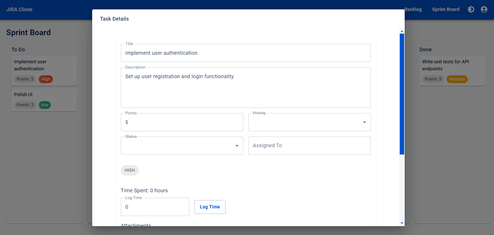

# JIRA (built by [AutoCode](https://autocode.work) in 20 minutes)

A lightweight project management tool, built with React and MongoDB



## DEMO

https://jira.autocode.work/

## Features

-   Backlog: Manage and prioritize your project tasks
-   Sprint Board: Visualize and track progress during sprints

## Planned Enhancements

-   User Authentication: Implement secure login and user management
-   Drag-and-Drop Functionality: Enhance user experience for task management
-   Search and Filter: Add advanced search capabilities for tasks
-   Reporting: Implement burndown charts and sprint velocity metrics
-   Mobile Responsiveness: Optimize the application for various screen sizes
-   Task Comments: Implement a comment system for tasks
-   Custom Fields: Allow users to add custom fields to tasks
-   Version Control Integration: Link tasks to Git commits or pull requests
-   Workflow Customization: Allow users to define custom workflows
-   Time Tracking: Implement time logging and estimation features
-   Integration with External Tools: Connect with popular development tools

## Project Structure

```
src/
├── components/
│   ├── Backlog.js
│   ├── Header.js
│   ├── SprintBoard.js
│   └── TaskCard.js
├── services/
│   └── apiService.js
├── utils/
│   └── theme.js
├── App.js
└── index.js
server/
├── model/
│   ├── Project.js
│   ├── Sprint.js
│   ├── Status.js
│   ├── Task.js
│   ├── User.js
│   └── Workflow.js
└── server.js
```

## Technical Improvements

-   Optimize API integration and data fetching strategies
-   Implement proper error handling and logging
-   Enhance security measures (e.g., input validation, XSS protection)
-   Optimize database queries and implement indexing
-   Set up monitoring and alerting systems
-   Implement rate limiting and request throttling

## Getting Started

1. Clone the repository
2. Install dependencies:
    - Frontend: `cd src && npm install`
    - Backend: `cd server && npm install`
3. Start the development servers:
    - Frontend: `npm start`
    - Backend: `npm run dev`

## Docker Support

The project includes Docker configuration for easy deployment:

1. Build the Docker images: `docker-compose build`
2. Run the containers: `docker-compose up`

## Documentation

Comprehensive documentation is available in the `docs` folder, including:

-   Application description
-   Release notes
-   Privacy policy
-   Social media content
-   API documentation
-   User guides

# TODO

